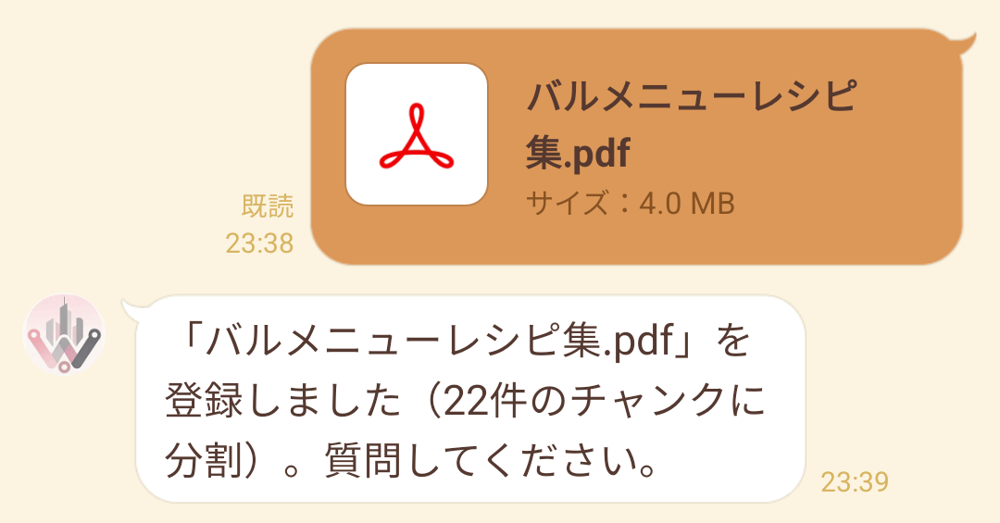
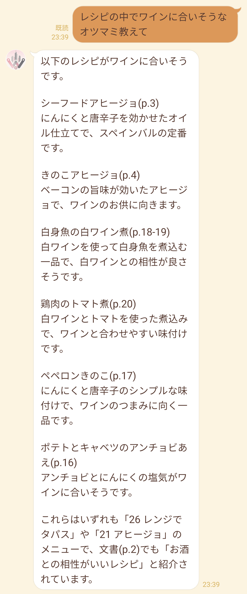
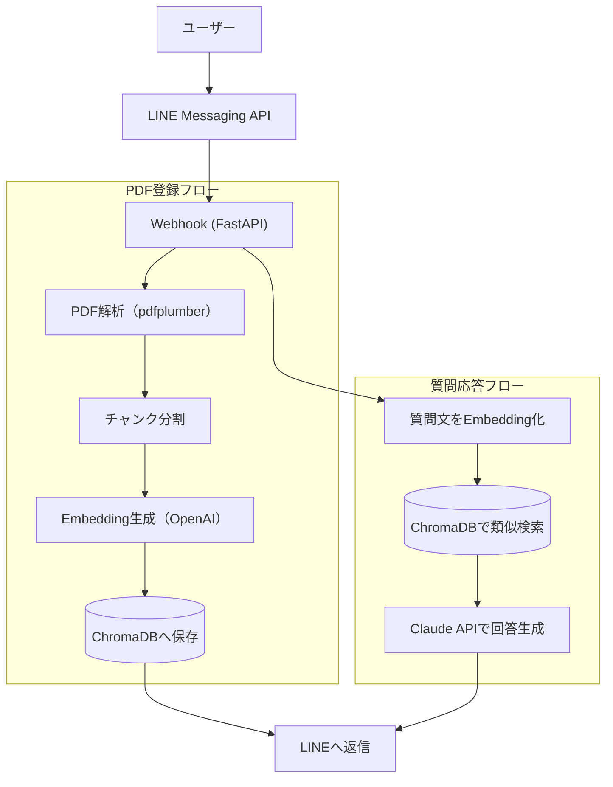

# LINE × RAG ドキュメントQA Bot

LINEにPDFファイルを送ると内容を登録し、自然言語で質問すると文書の内容に基づいて回答するチャットボットです。
RAG（Retrieval-Augmented Generation）構成を、LINE Messaging API・ChromaDB・Claude APIで実装しています。

## デモ

<table>
  <tr>
    <td width="50%" valign="top">
      
      <br>PDFを送ると、テキスト抽出からベクトルDB登録までを自動実行します。
    </td>
    <td width="50%" valign="top">
      
      <br>文書に直接書かれていない条件でも、記述内容から判断して回答します。
    </td>
  </tr>
</table>

上の例では、レシピ集に「ワインに合う」という記載はありません。材料や調味料の記述から該当するレシピを判断し、出典ページを添えて回答しています。

## 特徴

- LINEにPDFを送るだけで、テキスト抽出・チャンク分割・Embedding生成・ベクトルDB登録までを自動実行
- 登録した文書に対して自然言語で質問すると、文書の記述から判断した回答をページ番号付きで返す
- 条件が文書中の語と一致しない質問（例：「ワインに合うレシピは？」）にも、記述内容からの推論で回答
- 文書の一覧表示・削除にも対応
- API障害やPDF解析失敗など、想定されるエラーに対してユーザーへ分かりやすい案内メッセージを返す

## 使い方（LINE上でのコマンド）

| 操作 | 方法 |
|---|---|
| 文書の登録 | PDFファイルをそのままトーク画面に送信 |
| 質問する | 登録済み文書の内容についてテキストで質問を送信 |
| 登録済み文書の一覧 | 「一覧」と送信 |
| 文書の削除 | 「削除 ファイル名.pdf」と送信 |

## アーキテクチャ



主なパラメータ:

- チャンク分割: 1チャンク最大800文字、前後100文字を重複させる（`app/rag/chunker.py`）
- 参考文書の決定: 登録済み文書の総文字数が10万文字以下なら全文を渡し、超える場合のみ類似チャンクを上位20件検索する（`app/rag/qa.py`）
- 出典の提示: 参考文書にファイル名とページ番号を付けてプロンプトに入れ、回答に根拠を添えさせる（`app/rag/qa.py`）

上位k件の検索だけに頼ると、質問の条件が文書中の語と一致しない場合（例: レシピ集に対する「ワインに合うレシピは？」）に該当チャンクを引けません。全文が収まる規模なら検索で絞り込まず渡し、取捨選択をLLMに任せています。

## 技術スタック

| カテゴリ | 技術 | 選定理由 |
|---|---|---|
| 言語 | Python 3.12 | AI/RAG系ライブラリの充実 |
| パッケージ管理 | uv | Rust実装で高速、Pythonバージョン管理と依存管理を1ツールで完結 |
| Webフレームワーク | FastAPI | 非同期対応・型安全・軽量 |
| LLM API | Claude API（Anthropic） | 日本語性能・コストパフォーマンス |
| Embedding | OpenAI Embeddings API | ベクトル検索用 |
| ベクトルDB | ChromaDB | ローカル動作・無料・Python親和性が高い |
| PDF解析 | pdfplumber | テーブル含むPDF対応 |
| LINE連携 | line-bot-sdk（v3 API） | 公式SDK |
| ホスティング | Render（Free Tier） | 無料・GitHub連携デプロイ |
| Lint / Format | ruff | Lintとフォーマットを単一ツールで完結 |
| テスト | pytest | 外部APIを差し替えた単体テストに必要十分 |

## ディレクトリ構成

```
app/
├── main.py             # FastAPIエントリーポイント（LINE Webhookの受け口）
├── config.py           # 環境変数・設定管理
├── exceptions.py       # アプリ共通の例外クラス
├── line/
│   ├── handler.py      # LINE Webhookイベント処理
│   └── messages.py     # LINE返信メッセージ定義
├── rag/
│   ├── pdf_parser.py   # PDF解析・テキスト抽出
│   ├── chunker.py      # テキストチャンク分割
│   ├── embeddings.py   # Embedding生成
│   ├── vectorstore.py  # ChromaDB操作
│   └── qa.py           # 参考文書の決定と回答生成
└── llm/
    └── claude.py       # Claude APIクライアント

tests/
├── conftest.py
├── test_chunker.py     # 分割の境界条件・不正な引数
├── test_pdf_parser.py  # 抽出結果・解析失敗時の例外変換
└── test_qa.py          # 参考文書の決定・プロンプトの組み立て

doc/
└── 要件定義_LINE_RAG_QA_Bot.md
```

## セットアップ

### 前提

- Python 3.12+
- [uv](https://docs.astral.sh/uv/)
- LINE Developersアカウント（Messaging APIチャネル）
- Anthropic APIキー、OpenAI APIキー

### 手順

1. リポジトリをクローンし、依存パッケージをインストール

   ```bash
   uv sync
   ```

2. `.env.example` を `.env` にコピーし、各キーを設定

   ```bash
   cp .env.example .env
   ```

   ```
   LINE_CHANNEL_SECRET=xxxx
   LINE_CHANNEL_ACCESS_TOKEN=xxxx
   ANTHROPIC_API_KEY=xxxx
   OPENAI_API_KEY=xxxx
   ```

3. ローカルで起動

   ```bash
   uv run uvicorn app.main:app --reload
   ```

4. LINE DevelopersコンソールのWebhook URLに、公開したエンドポイント（例: Renderにデプロイした場合は `https://<デプロイ先>/callback`）を設定し、Webhookの利用をオンにする

### Renderへのデプロイ

リポジトリルートの [render.yaml](render.yaml) をBlueprintとして読み込むことで、ビルド・起動コマンドと環境変数の枠が自動設定されます。`LINE_CHANNEL_SECRET` / `LINE_CHANNEL_ACCESS_TOKEN` / `ANTHROPIC_API_KEY` / `OPENAI_API_KEY` はRenderダッシュボード側で個別に入力してください。

### Lint

```bash
uv run ruff check .
uv run ruff format .
```

### テスト

```bash
uv run pytest
```

Embedding・ベクトルDB・Claude APIはすべて差し替えているため、APIキーなしで実行できます。チャンク分割の境界条件と不正な引数、PDF解析の失敗時の例外変換、参考文書の決定とプロンプトの組み立てを検証しています。

## 非機能要件

- 対応ファイル：PDF（10MBまで）
- レスポンス目標：LINE返信まで10秒以内
- 想定規模：小規模（単一インスタンス構成）
- 可用性：Render Free Tierのため、一定時間アクセスがないとスリープする
- 文書の永続性：Render Free Tierはファイルシステムが揮発性のため、再起動・再デプロイで登録済み文書が失われる（外部ベクトルDBへの移行で解消可能）

## 今後の拡張

- テキストファイル（.txt / .md）対応
- 処理中メッセージの送信（受信直後に即時応答し、完了を別メッセージで通知する非同期化）
- 外部ベクトルDBへの移行による文書の永続化
- 長い文書に対する検索精度の改善（検索語の自動生成による多段検索）
- Webダッシュボード（Streamlit）でのドキュメント管理
- Docker化
- ユーザーごとのドキュメント管理（マルチテナント化）

## ライセンス

[MIT License](LICENSE)
