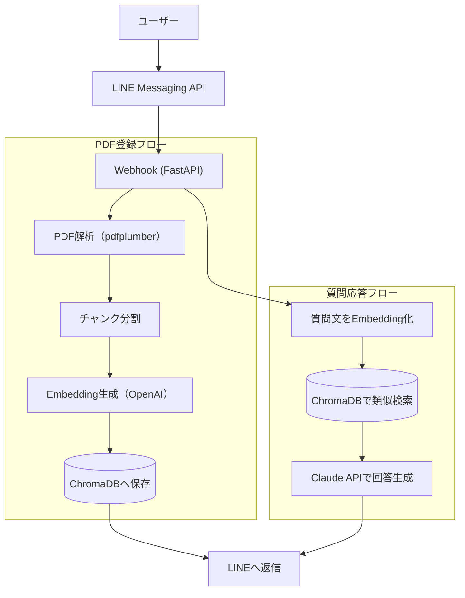

# LINE × RAG ドキュメントQA Bot

LINEにPDFファイルを送ると内容を登録し、自然言語で質問すると文書の内容に基づいて回答するチャットボットです。
RAG（Retrieval-Augmented Generation）構成を、LINE Messaging API・ChromaDB・Claude APIで実装しています。

## 特徴

- LINEにPDFを送るだけで、テキスト抽出・チャンク分割・Embedding生成・ベクトルDB登録までを自動実行
- 登録した文書に対して自然言語で質問すると、関連する箇所をもとにClaudeが日本語で回答
- 文書の一覧表示・削除にも対応
- API障害やPDF解析失敗など、想定されるエラーに対してユーザーへ分かりやすい案内メッセージを返す

## 使い方（LINE上でのコマンド）

| 操作 | 方法 |
|---|---|
| 文書の登録 | PDFファイルをそのままトーク画面に送信 |
| 質問する | 登録済み文書の内容についてテキストで質問を送信 |
| 登録済み文書の一覧 | 「一覧」と送信 |
| 文書の削除 | 「削除 ファイル名.pdf」と送信 |

## アーキテクチャ



主なパラメータ:

- チャンク分割: 1チャンク最大800文字、前後100文字を重複させる（`app/rag/chunker.py`）
- 類似検索: 上位5件を取得し、ファイル名とページ番号を添えてプロンプトに入れる（`app/rag/qa.py`）

## 技術スタック

| カテゴリ | 技術 | 選定理由 |
|---|---|---|
| 言語 | Python 3.12 | AI/RAG系ライブラリの充実 |
| パッケージ管理 | uv | Rust実装で高速、Pythonバージョン管理と依存管理を1ツールで完結 |
| Webフレームワーク | FastAPI | 非同期対応・型安全・軽量 |
| LLM API | Claude API（Anthropic） | 日本語性能・コストパフォーマンス |
| Embedding | OpenAI Embeddings API | ベクトル検索用 |
| ベクトルDB | ChromaDB | ローカル動作・無料・Python親和性が高い |
| PDF解析 | pdfplumber | テーブル含むPDF対応 |
| LINE連携 | line-bot-sdk（v3 API） | 公式SDK |
| ホスティング | Render（Free Tier） | 無料・GitHub連携デプロイ |
| Lint | ruff | 高速・設定がシンプル |

## ディレクトリ構成

```
app/
├── main.py             # FastAPIエントリーポイント（LINE Webhookの受け口）
├── config.py           # 環境変数・設定管理
├── exceptions.py       # アプリ共通の例外クラス
├── line/
│   ├── handler.py      # LINE Webhookイベント処理
│   └── messages.py     # LINE返信メッセージ定義
├── rag/
│   ├── pdf_parser.py   # PDF解析・テキスト抽出
│   ├── chunker.py      # テキストチャンク分割
│   ├── embeddings.py   # Embedding生成
│   ├── vectorstore.py  # ChromaDB操作
│   └── qa.py           # 質問応答（検索+LLM呼び出し）
└── llm/
    └── claude.py       # Claude APIクライアント
```

## セットアップ

### 前提

- Python 3.12+
- [uv](https://docs.astral.sh/uv/)
- LINE Developersアカウント（Messaging APIチャネル）
- Anthropic APIキー、OpenAI APIキー

### 手順

1. リポジトリをクローンし、依存パッケージをインストール

   ```bash
   uv sync
   ```

2. `.env.example` を `.env` にコピーし、各キーを設定

   ```bash
   cp .env.example .env
   ```

   ```
   LINE_CHANNEL_SECRET=xxxx
   LINE_CHANNEL_ACCESS_TOKEN=xxxx
   ANTHROPIC_API_KEY=xxxx
   OPENAI_API_KEY=xxxx
   ```

3. ローカルで起動

   ```bash
   uv run uvicorn app.main:app --reload
   ```

4. LINE DevelopersコンソールのWebhook URLに、公開したエンドポイント（例: Renderにデプロイした場合は `https://<デプロイ先>/callback`）を設定し、Webhookの利用をオンにする

### Renderへのデプロイ

リポジトリルートの [render.yaml](render.yaml) をBlueprintとして読み込むことで、ビルド・起動コマンドと環境変数の枠が自動設定されます。`LINE_CHANNEL_SECRET` / `LINE_CHANNEL_ACCESS_TOKEN` / `ANTHROPIC_API_KEY` / `OPENAI_API_KEY` はRenderダッシュボード側で個別に入力してください。

### Lint

```bash
uv run ruff check .
uv run ruff format .
```

## 非機能要件

- 対応ファイル：PDF（10MBまで）
- レスポンス目標：LINE返信まで10秒以内
- 想定規模：小規模（単一インスタンス構成）
- 可用性：Render Free Tierのため、一定時間アクセスがないとスリープする

## 今後の拡張

- テキストファイル（.txt / .md）対応
- 複数ドキュメントの横断検索
- 回答時のソース引用（ページ番号表示）のLINEメッセージへの反映強化
- Webダッシュボード（Streamlit）でのドキュメント管理
- Docker化
- ユーザーごとのドキュメント管理（マルチテナント化）

## ライセンス

[MIT License](LICENSE)
